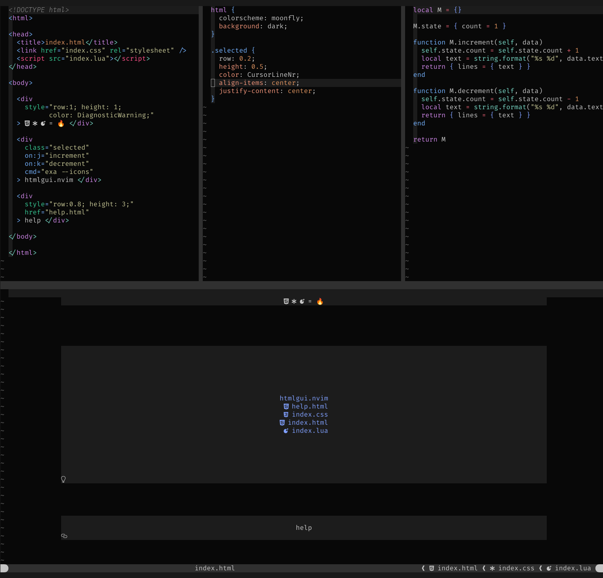
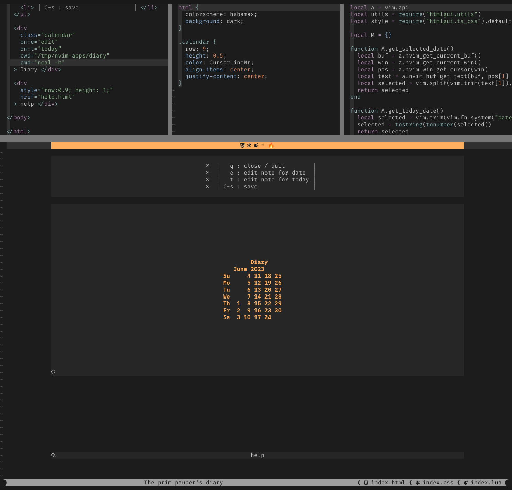
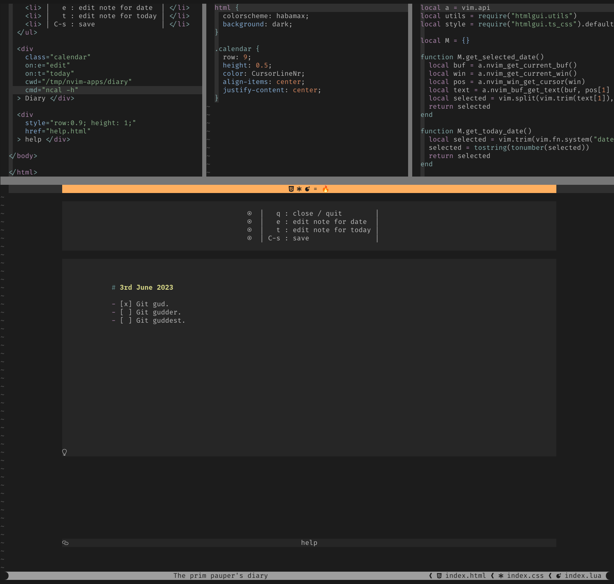
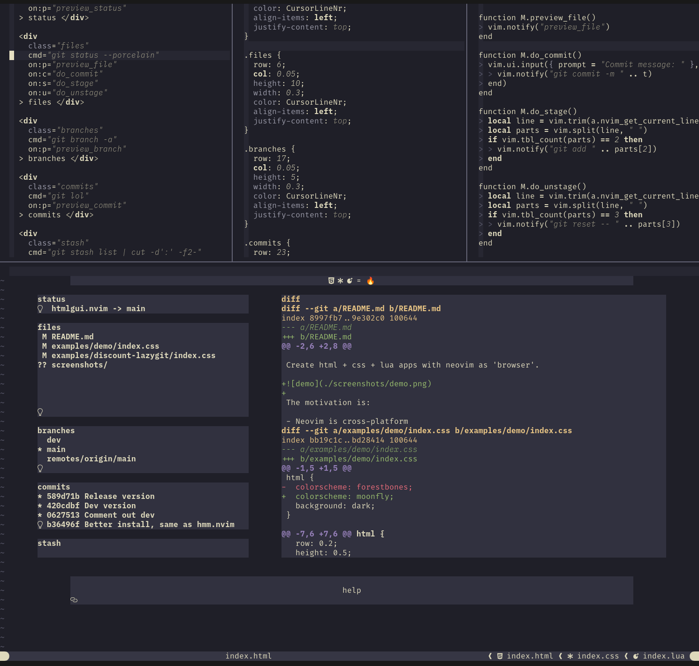

# htmlgui.nvim

Create html + css + lua apps with neovim as 'browser'.

The motivation is:

- Neovim is cross-platform
- consistent 'native ui'
- already looks good out of the box
- easy access to features, themes through plugins
- now supports `NVIM_APPNAME`, allowing for standalone apps
- startup is blazing fast 🔥
- easy way to share custom widgets, simply using `lazy.nvim`
- app elements like div, navbar, tabs, toasts, etc. already available
- package management is automatic with `lazy.nvim`
- already has searchable DOM using treesitter
  - so technically, possible to render HTML to a 'Neovim GUI'

TLDR:

- dom - html
- style - css
- script - lua
- browser - neovim
- engine - htmlgui.nvim for now
- elements - htmlgui.html for now ( should have used `nui.nvim` )

## Examples

### demo



### cheapass-diary




### discount-lazygit



## Installation

First install Neovim >= 0.9 ( which supports `NVIM_APPNAME` ) from [here](https://neovim.io/).

Install nerdfont of choice from [nerdfont](https://www.nerdfonts.com/font-downloads).

Then clone the repo, install and check out an example.

```bash
git clone https://github.com/manyids2/htmlgui.nvim
cd htmlgui.nvim

# Install htmlgui.nvim to `$XDG_CONFIG_DIR/nvim-apps/htmlgui.nvim`
# Installs shell script to `/usr/bin/htmlgui.nvim`, asks for sudo
make install

# Check out the main features
cd examples
htmlgui.nvim index.html
```

## So many possibilities

- [x] inbuilt debugger
- [x] hyperlinks with href
- [x] element definitions and defaults
- [x] highlights instead of background/foreground using treesitter
- [x] run shell command for element
- [ ] dom in any language supported by treesitter
  - theoretically, can 'code' dom, style in absolutely any language
  - needs examples, actual use cases, like viz python, markdown, etc as webpage
- [ ] providing context with jinja
- [ ] uvloop for animation
- [ ] 'canvas' element
- [ ] support entire paths instead of filenames
- [ ] get scripts, styles from plugins like CDN, just need to install with lazy
- [ ] get widgets, components similarly
- [ ] 'config' itself as webpage
- [ ] help with ? per element, global
- [ ] tabbing with treesitter elements

## So many details

## Fails

- [ ] Not using `nui.nvim`
- [ ] css preference order
- [ ] zoom is wonky when on floats, needs to be disabled/handled there
- [ ] no actual nested multiline divs
  - ( for now just divs at depth 1 and single line between `>` and `<`)
- [ ] no layout engine ( make lua bindings for [yoga](https://yogalayout.com/)? )
- [ ] no create / delete elements from callbacks

## Core modules

### init

Calls `app.setup(config)`.

### app

Module to store state and transitions of htmlgui.

- `config`
- `info`
- `state.dom` -
- `state.gui` -
- `state.css` -
- `state.lua` -
- `state.data` - store of html elements in body in our format (data)
- `script` - reload on `set_keymaps`
- `style` - reload on rendesr

### layout

- `data`
- `element`

### ts_css

### ts_html

### html

### utils
